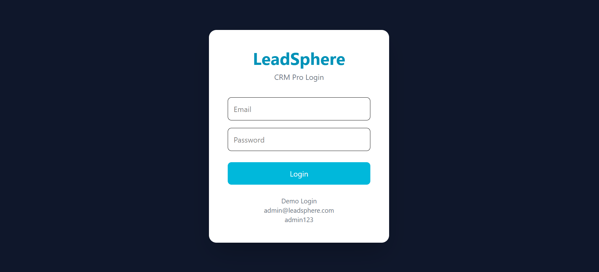
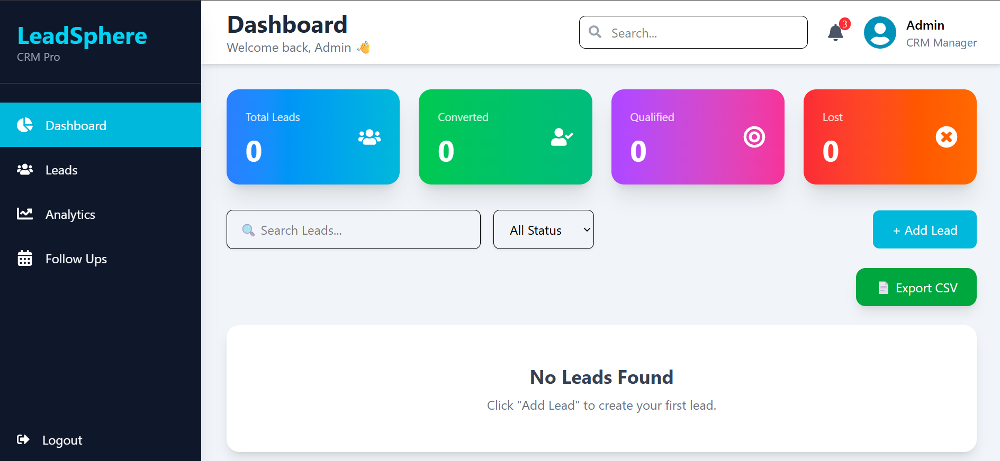
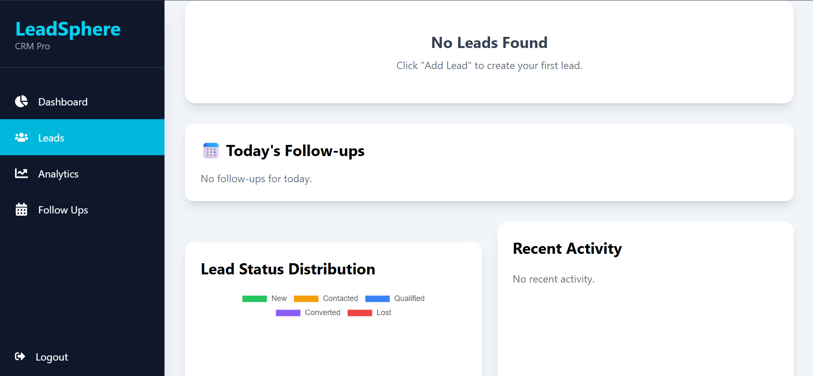
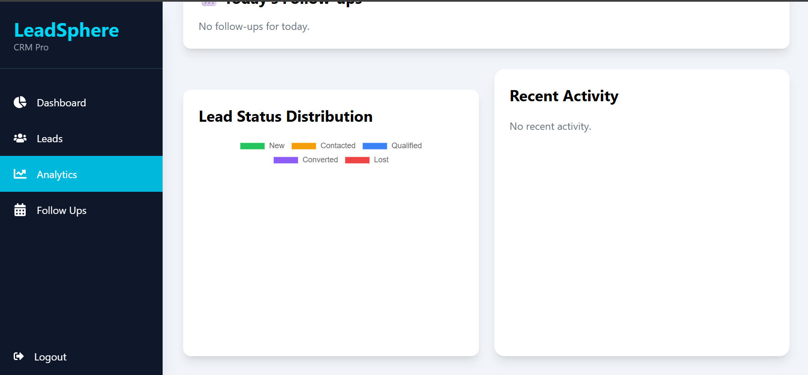
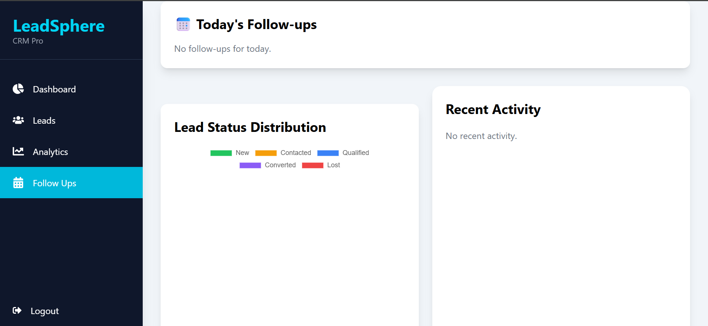

# LeadSphere CRM

A Customer Relationship Management (CRM) web application developed using React, Express.js, and Tailwind CSS. This project was built as part of the Future Interns Internship Program to manage customer leads through a simple and responsive interface.

---

## Overview

LeadSphere CRM allows users to manage customer leads efficiently by providing features such as lead creation, editing, deletion, searching, filtering, follow-up tracking, analytics, and CSV export.

---

## Features

- User Login Interface
- Dashboard with Lead Statistics
- Create, Update and Delete Leads
- Search Leads
- Filter Leads by Status
- Follow-Up Management
- Analytics Dashboard
- Export Leads to CSV
- Toast Notifications
- Responsive User Interface

---

## Technologies Used

### Frontend
- React.js
- Vite
- Tailwind CSS
- Axios
- React Router
- React Toastify
- Chart.js
- React Icons

### Backend
- Node.js
- Express.js

### Data Storage
- JSON File

### Version Control
- Git & GitHub

---

## Project Structure

```
FUTURE_FS_02
│
├── client
│   ├── src
│   ├── public
│   ├── package.json
│   └── vite.config.js
│
├── server
│   ├── routes
│   ├── data
│   ├── server.js
│   └── package.json
│
├── screenshots
└── README.md
```

---

## Screenshots

### Login



### Dashboard



### Lead Management



### Analytics



### Follow Ups



---

## Installation

Clone the repository:

```bash
git clone https://github.com/nakkamanikanta2007-max/FUTURE_FS_02.git
```

Install frontend dependencies:

```bash
cd client
npm install
npm run dev
```

Install backend dependencies:

```bash
cd server
npm install
npm start
```

---

## Future Improvements

- MongoDB Integration
- JWT Authentication
- User Profile Management
- Dark Mode
- Email Notifications
- Advanced Analytics

---

## Developer

**Nakka Yogi Venkat Durga Sai Manikanta**

B.Tech – Computer Science & Engineering

Developed as part of the **Future Interns Internship Program**.

---

## Live Demo

Frontend:
https://future-fs-02-omega-eight.vercel.app/

Backend API:
https://future-fs-02-td9y.onrender.com/

---

## Repository

GitHub Repository:
https://github.com/nakkamanikanta2007-max/FUTURE_FS_02

---
Thank you for Visting
